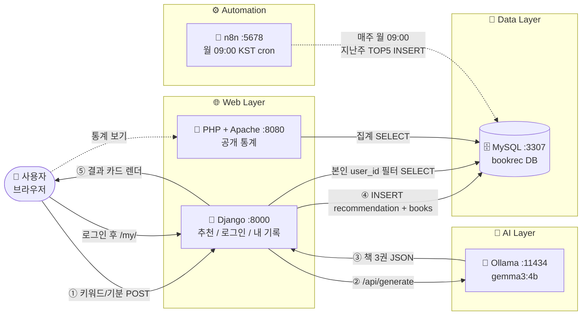

# 📚 AI 책 추천 웹앱

WSL2 + Docker Compose로 한 번에 띄우는 AI 책 추천 시스템입니다.
사용자가 키워드/기분을 입력하면 로컬 LLM (Ollama gemma3:4b)이 책 3권을 JSON으로 추천하고, 결과는 MySQL에 저장됩니다. n8n이 매주 월요일 09:00에 TOP5 키워드를 집계하고, PHP 통계 페이지에서 키워드 집계를, Django 개인 페이지에서 본인 추천 기록을 볼 수 있습니다.

---

## 🏗️ 아키텍처 (좌 → 우 흐름)



---

## 🧩 구성

| 서비스 | 역할 | 호스트 포트 |
|---|---|---|
| `django` | 메인 웹앱 — 추천 입력, AI 호출, 저장, 회원가입/로그인, 내 추천 기록 | `8000` |
| `ollama` | gemma3:4b 추론 서버. 컨테이너 시작 시 모델 자동 pull, GPU 있으면 CUDA / 없으면 CPU 폴백 | `11434` |
| `mysql` | 추천 / 책 / 사용자 / 주간 TOP5 키워드 저장 | `3307` |
| `n8n` | 매주 월 09:00 KST에 지난 7일 TOP5 키워드 집계 → MySQL | `5678` |
| `php_stats` | Apache + PHP 공개 통계 페이지 (개별 책 / 사용자 정보 노출 X) | `8080` |

모든 서비스는 동일한 `abr_net` Docker 네트워크에 있고, 컨테이너끼리는 서비스명(`mysql`, `ollama`, …)으로 통신합니다.

---

## 📂 폴더 구조

```
ai-book-recommender/
├── docker-compose.yml
├── .env / .env.example
├── README.md
├── django_app/              # 메인 웹앱 (Django)
│   ├── Dockerfile
│   ├── requirements.txt
│   ├── manage.py
│   ├── config/              # settings, urls, wsgi
│   └── recommender/
│       ├── models.py        # Recommendation / Book / WeeklyTopKeyword
│       ├── views.py         # index / my_history / signup
│       ├── ollama_client.py # /api/generate 호출 + JSON 파싱
│       ├── migrations/      # 0001_initial, 0002_recommendation_user
│       └── templates/
│           ├── recommender/ # base, index, result, my_history
│           └── registration/ # login, signup
├── ollama/
│   ├── Dockerfile
│   └── entrypoint.sh        # ollama serve + 자동 pull + GPU 감지
├── mysql/init/
│   └── 01_schema.sql        # 첫 부팅 시 스키마 생성 (utf8mb4)
├── n8n/workflows/
│   └── weekly_top_keywords.json   # 월 09:00 cron 워크플로
└── php_stats/
    ├── Dockerfile           # php:8.2-apache + UTF-8 강제
    ├── apache-utf8.conf
    └── src/
        ├── index.php        # 통계 페이지
        ├── stats.php        # /stats 별칭
        ├── db.php           # PDO + utf8mb4 SET NAMES
        └── .htaccess        # /stats 라우팅
```

---

## ⚡ 핵심 흐름

1. 사용자가 메인(`/`)에서 키워드 입력 (예: `우울할 때`, `판타지`)
2. Django가 Ollama `POST /api/generate` 호출 (model=`gemma3:4b`, `format=json`)
3. 모델 응답을 책 3권 JSON 배열로 파싱 → `recommender_recommendation` + `recommender_book` 에 저장
   - 로그인 상태면 `user_id` 에 본인 PK 저장, 익명이면 NULL
4. 결과 카드 화면 렌더
5. 매주 월 09:00 KST → n8n이 지난 7일 키워드 GROUP BY → TOP5 → `recommender_weeklytopkeyword`
6. PHP `/stats` 는 키워드별 집계 + 주간 TOP5 만 공개 (개별 책 / 사용자 정보 노출 X)
7. 로그인 사용자는 Django `/my/` 에서 본인 추천 기록 + 책 목록 확인

---

## 🚀 실행 방법

### 사전 준비

- WSL2 (Ubuntu 권장)
- Docker Desktop (WSL2 통합 켠 상태) **또는** WSL 안에 설치된 Docker Engine + Compose
- (선택) NVIDIA GPU + `nvidia-container-toolkit` — 있으면 Ollama가 자동으로 CUDA 사용

GPU가 없는 환경이라면 `docker-compose.yml` 의 `ollama` 서비스에서 `deploy:` 블록을 주석 처리하세요:

```yaml
    # deploy:
    #   resources:
    #     reservations:
    #       devices:
    #         - driver: nvidia
    #           count: all
    #           capabilities: [gpu]
```

### 기동

```bash
cd ai-book-recommender

# 1) 환경변수 파일 준비 (비밀번호와 SECRET_KEY 변경 권장)
cp -n .env.example .env
$EDITOR .env

# 2) 빌드 & 기동 (Ollama가 첫 부팅 시 gemma3:4b 약 3.3GB pull → 수 분 소요)
docker-compose up -d --build

# 3) Ollama 진행 상황 확인
docker-compose logs -f ollama
```

`ready.` 또는 `attaching to ollama serve` 메시지가 보이면 모델 준비 완료.

### 접속

| 화면 | URL | 인증 |
|---|---|---|
| 메인 (추천 입력) | http://localhost:8000/ | 익명 가능 |
| 회원가입 | http://localhost:8000/signup/ | — |
| 로그인 | http://localhost:8000/login/ | — |
| 내 추천 기록 | http://localhost:8000/my/ | 로그인 필요 |
| 통계 (공개) | http://localhost:8080/  또는  /stats | 비공개 데이터 미노출 |
| n8n | http://localhost:5678/ | `.env` 의 `N8N_USER` / `N8N_PASSWORD` (기본 `admin` / `admin1234`) |
| Ollama API | http://localhost:11434/ | — |

---

## 🔧 n8n 워크플로 임포트 (최초 1회)

n8n credential은 컨테이너 볼륨에 저장돼야 해서 자동 import가 안전하지 않습니다. 처음 한 번만 UI에서:

1. http://localhost:5678/ 접속 → 로그인
2. 좌측 ⋯ 메뉴 → **Import from File**
3. `n8n/workflows/weekly_top_keywords.json` 선택 (컨테이너 안 경로: `/workflows/weekly_top_keywords.json`)
4. **Credentials → New → MySQL** 생성:
   - Host: `mysql`
   - Database: `bookrec`
   - User: `bookuser`
   - Password: `.env` 의 `MYSQL_PASSWORD`
   - Port: `3306`
5. 워크플로의 MySQL 노드에 위 credential 연결
6. **Active** 토글 ON

검증은 우상단 **Execute Workflow** 버튼으로 한 번 수동 트리거 → 노드들이 초록색이면 성공.

---

## 🧪 검증 명령

### 추천 데이터 확인 (사용자별 포함)
```bash
docker-compose exec mysql mysql --default-character-set=utf8mb4 \
  -ubookuser -pbookpw_change_me bookrec -e \
  "SELECT r.id, u.username, r.keyword, r.created_at
   FROM recommender_recommendation r
   LEFT JOIN auth_user u ON u.id = r.user_id
   ORDER BY r.id DESC LIMIT 20;"
```

### 추천 1건의 책 3권 펼쳐 보기
```bash
docker-compose exec mysql mysql --default-character-set=utf8mb4 \
  -ubookuser -pbookpw_change_me bookrec -e \
  "SELECT r.keyword, b.position, b.title, b.author, b.summary, b.reason
   FROM recommender_book b
   JOIN recommender_recommendation r ON r.id = b.recommendation_id
   WHERE r.id = (SELECT MAX(id) FROM recommender_recommendation)
   ORDER BY b.position;"
```

### 주간 TOP5 확인
```bash
docker-compose exec mysql mysql --default-character-set=utf8mb4 \
  -ubookuser -pbookpw_change_me bookrec -e \
  "SELECT week_start, rank_no, keyword, hit_count
   FROM recommender_weeklytopkeyword
   ORDER BY week_start DESC, rank_no;"
```

### Ollama 단독 호출 테스트
```bash
curl -s http://localhost:11434/api/generate \
  -d '{"model":"gemma3:4b","prompt":"hi","stream":false}' | head -c 300
```

---

## 🧹 정리

```bash
docker-compose down            # 컨테이너만 정리 (데이터 유지)
docker-compose down -v         # 볼륨까지 삭제 (DB / Ollama 모델 / n8n 데이터 모두 초기화)
```

`down -v` 후 다시 기동하면 Ollama가 모델을 재다운로드 (약 3.3GB), n8n credential 도 다시 등록해야 합니다.

---

## 🔐 데이터 정책

| 데이터 | 저장 위치 | 노출 |
|---|---|---|
| 사용자 계정 (id/pw) | `auth_user` (Django 기본) | 본인만 |
| 추천 요청 (keyword) | `recommender_recommendation` | PHP `/stats` 에서 키워드 단위 집계만 공개 |
| 추천된 책 (title/author/summary/reason) | `recommender_book` | **본인만** (Django `/my/`) |
| 주간 TOP5 | `recommender_weeklytopkeyword` | PHP `/stats` 공개 |

익명 추천(user_id=NULL)은 PHP 집계엔 포함되지만 어떤 사용자의 "내 추천 기록"에도 표시되지 않습니다.

---

## 📜 라이선스

학습/개인용 프로젝트.
